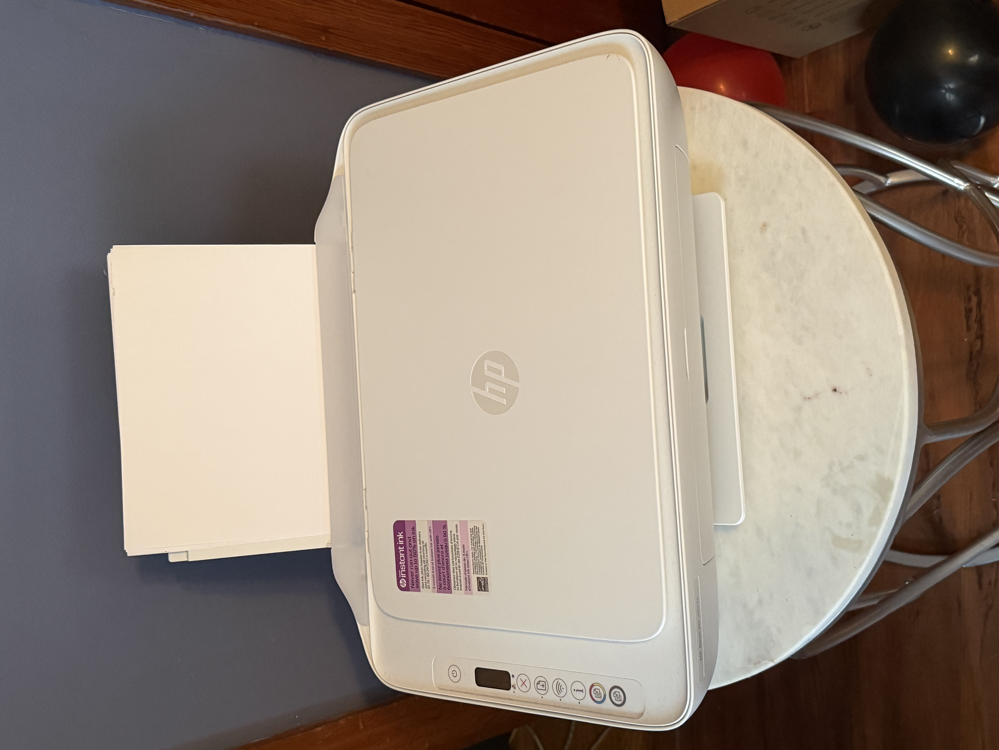
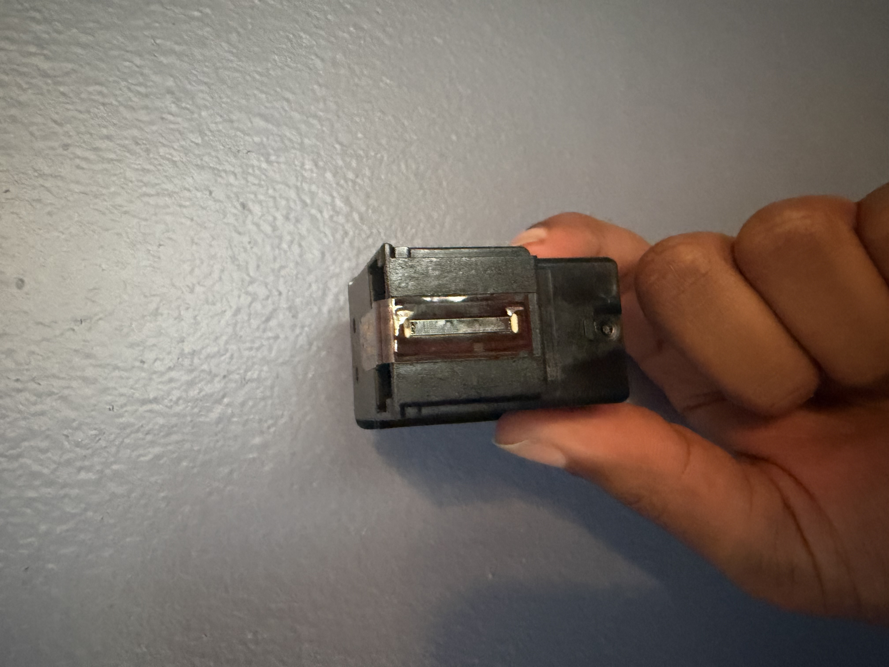
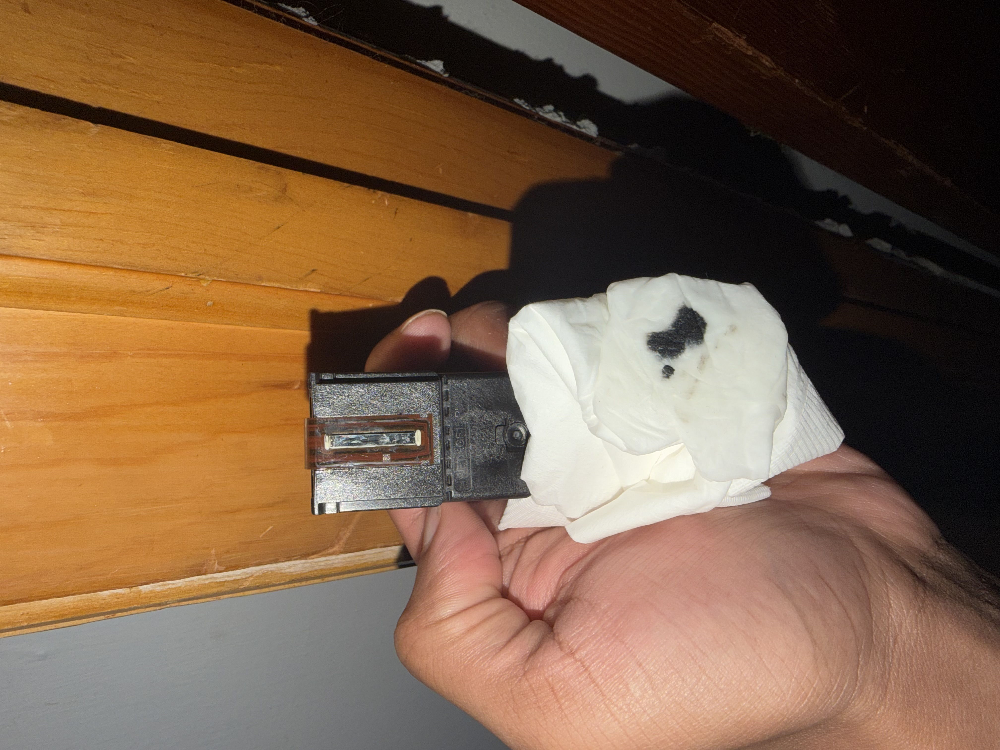
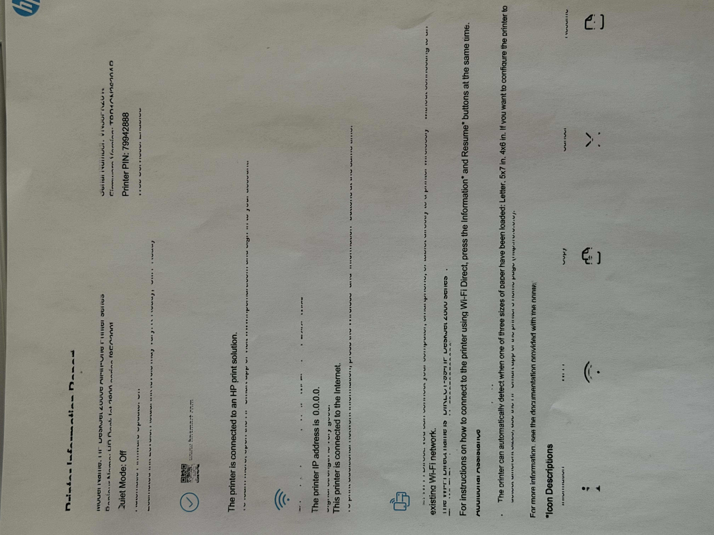
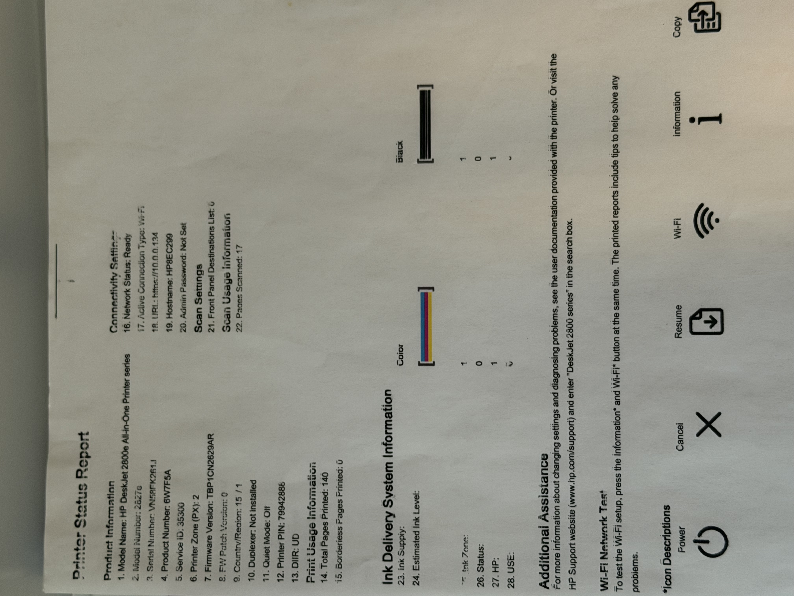

# HP DeskJet 2827e Printer Troubleshooting

## Project Overview

This project documents troubleshooting performed on an HP DeskJet 2827e All-in-One printer experiencing two separate issues:

- Black ink was not printing correctly.
- A client's iPhone could not discover the printer for wireless printing.

The troubleshooting process involved testing the printer, diagnosing the black ink cartridge, verifying network connectivity, identifying the client connectivity issue, and completing an end-to-end wireless print test.

---

## Phase 1 – Initial Printer Diagnosis

The printer was restarted to rule out a temporary software or hardware issue.

A printer information page was then generated directly from the printer.

The printer successfully loaded and fed the paper, but almost all black text was missing while color elements were still visible.

This confirmed that the paper-feed mechanism was functioning and narrowed the issue to black ink output.

---

## Phase 2 – Black Ink Cartridge Inspection

The black ink cartridge was removed for further inspection.

The cartridge initially appeared dry and produced little to no ink when tested.

A warm, damp paper towel was used to gently blot the cartridge nozzle area. This helped loosen dried ink around the nozzles and restore ink flow.

The cartridge then produced a visible black ink deposit, confirming that black ink was still present and capable of flowing through the cartridge.

---

## Phase 3 – Print Quality Recovery

The black cartridge was reinstalled and another printer information page was generated.

Black ink began printing again, although portions of the text were initially incomplete and streaked.

This represented a significant improvement from the original test where black output was almost completely absent.

Additional testing showed continued improvement in black ink output.

---

## Phase 4 – Network Troubleshooting

The printer's status and network information were checked to investigate why the client's iPhone could not discover the printer.

The printer was confirmed to have:

- An active Wi-Fi connection
- Network status of Ready
- A valid local IP address
- Internet connectivity

The client device was then checked.

The iPhone was connected to a different Wi-Fi network than the printer.

This explained why the printer could not initially be discovered from the client's device.

---

## Phase 5 – Wireless Printing Verification

The client's iPhone was connected to the same Wi-Fi network as the HP DeskJet.

After both devices were placed on the same network, the printer became discoverable through Apple AirPrint.

This confirmed successful communication between the client device and printer.

The client then successfully sent the required document from the iPhone to the printer.

The document printed successfully, completing an end-to-end test of the connection.

### Verified Communication Path

**iPhone → Wi-Fi Network → HP DeskJet 2827e → Physical Print Output**

---

## Resolution

Two separate problems were identified during troubleshooting.

### Print Quality

The black cartridge was still holding ink, but ink was not flowing correctly through the cartridge nozzles.

After manually testing and blotting the cartridge nozzle area with a warm, damp paper towel, black ink flow was restored and print quality substantially improved.

### Network Connectivity

The printer itself was connected to Wi-Fi, but the client's iPhone was connected to a different wireless network.

Connecting the client device to the same network as the printer allowed AirPrint to discover the HP DeskJet and successfully send print jobs.

The client was ultimately able to print the required document successfully.

---

## Skills Demonstrated

- Printer troubleshooting
- Inkjet cartridge diagnostics
- Print quality troubleshooting
- Hardware issue isolation
- Wireless network troubleshooting
- TCP/IP fundamentals
- IP configuration verification
- Client device troubleshooting
- Apple AirPrint testing
- End-to-end connectivity verification
- Technical documentation
